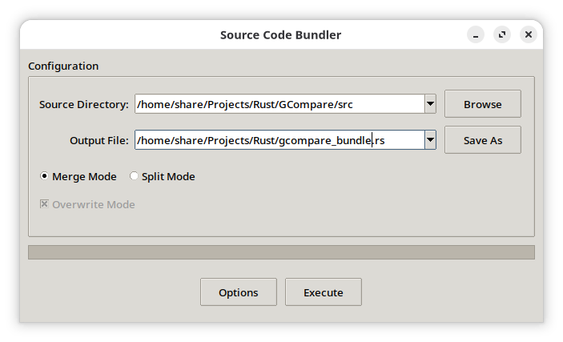
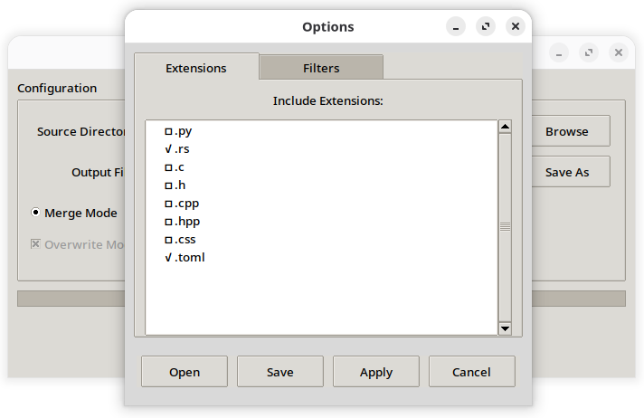
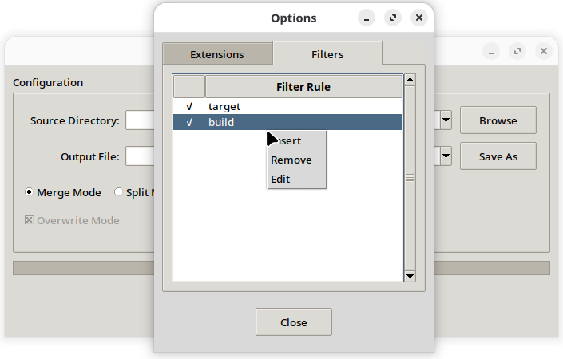
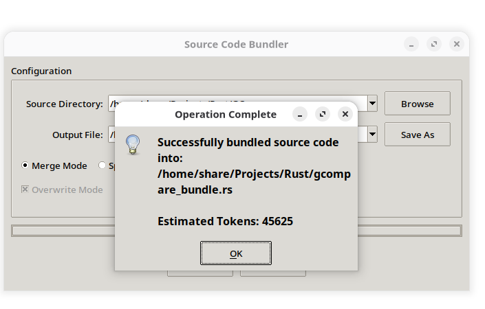

# Source Code Bundler

A versatile Python utility designed to merge multiple source code files into a single file and split them back into their original directory structure. This tool is particularly useful for feeding large codebases into Large Language Models (LLMs) or for simple archiving purposes.

## Features

- **Merge Mode**: Recursively scans a directory and combines source files into a single text file.
- **Split Mode**: Reconstructs the original file and directory structure from a bundled file.
- **Patch Mode**: Applies standard diff/patch files to a target directory.
- **Source Files Mode**: Select and merge specific individual files (bypasses extension/filter restrictions).
- **Language Support**: Automatically handles comment syntax for headers in Python (`.py`), Rust (`.rs`), C/C++ (`.c`, `.h`, `.cpp`, `.hpp`), CSS (`.css`), and TOML (`.toml`).
- **GUI Interface**: User-friendly graphical interface built with Tkinter.
- **CLI Support**: Command-line interface for batch processing and automation.
- **Configurable**: Select specific file extensions to include/exclude via the Options menu.
- **Safety**: Checks for path traversal attempts during the split process.
- **Token Estimation**: Provides an estimated token count for the bundled content to help size context for LLMs.









## Requirements

- Python 3.x
- Tkinter (usually included with standard Python installations)
- System `patch` command (required for Patch Mode)

## Installation

1. Clone the repository or download the script.
2. Ensure the script has execution permissions (optional on Linux/macOS):
   ```bash
   chmod +x source_code_bundler.py
   ```

## Usage

Run the script without arguments to launch the Graphical User Interface (GUI):

```bash
./source_code_bundler.py
# or
python source_code_bundler.py
```

### Merging Files (Bundle)

1. Select **Merge Mode**.
2. Click **Browse** next to "Source Directory" to choose the folder containing your source code.
3. Click **Save As** next to "Output File" to choose where to save the bundled text file.
4. (Optional) Click **Options** to filter specific file extensions and manage project settings.

### Project Files (Open/Save)

The Options dialog supports saving and loading project files:

1. Click **Options** to open the configuration dialog.
2. **Save Project**: Saves your current settings (extensions, filters, overwrite mode, and recent paths) to a JSON file.
3. **Open Project**: Loads a previously saved project file and restores all settings.
4. **Apply**: Applies changes made in the Options dialog to the global application state.
5. **Cancel**: Discards changes and closes the Options dialog.

Project files store:
- Selected file extensions
- Filter rules and their active states
- Overwrite mode preference
- Recent source/destination paths (limited to one entry per operation type)

This allows you to:
- Save different configurations for different projects
- Share project configurations between machines
- Quickly restore your preferred workspace setup
- Backup your settings before making changes

5. Click **Execute**. The application will display the estimated token count upon completion.

### Splitting Files (Unbundle)

1. Select **Split Mode**.
2. Click **Browse** next to "Source File" to select a previously bundled file.
3. Click **Save As** (which acts as a directory selector in this mode) to choose the destination folder for the extracted files.
4. Click **Execute**.

### Applying Patches

1. Select **Patch Mode**.
2. Click **Browse** next to "Patch File" to select your `.patch` or `.diff` file.
3. Click **Save As** (acts as directory selector) to choose the target directory where the patch should be applied.
4. Click **Execute**.

## Configuration

The application automatically creates a `source_code_bundler.json` file to store your preferences, such as window geometry and selected file extensions.

## License

This project is licensed under the MIT License.